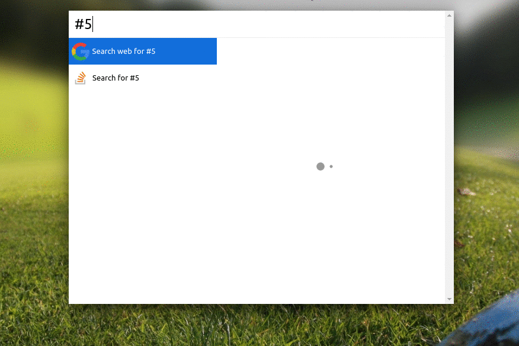

# convertColor

> [Cerebro](https://cerebroapp.com) plugin to generate hexadecimal based on rgb and vice and versa

## Usage

In Cerebro, type 'convertColor' followed by the code in RGB or Hexadecimal
* Press enter to copy the converted code

## Installing

* Type `plugins convertColor` into Cerebro
* Click `install`

## Related

- [Cerebro](http://github.com/KELiON/cerebro) – main repo for Cerebro app;

## License

MIT © Rafael Acioly